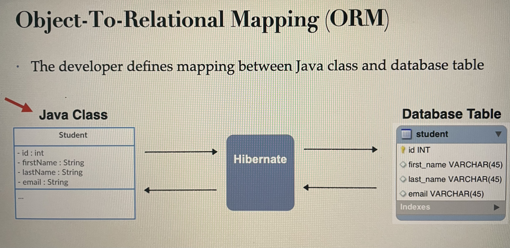

# Hibernate And JPA Overview
- What is Hibernate ?
- Benefits of Hibernate
- WHat is JPA
- Benefits of JPA
- Code Snippet
## Hibernate
- A framework for persisting/ saving Java Objects in Database.
- www.hibernate.org/orm
- Your Java Application <=> Hibernate <=> Database
## Benefits of Hibernate
- Hibernate handles all the low-level SQL
- Minimizes the amount of JDBC code you have to develop
- Hibernate provides the Object-to-Relational Mapping (ORM)

## Object to Relational Mapping (ORM)
  -  Java Class (Entity)
            ↓
    Hibernate ORM (JPA)
            ↓
    Database Table
## What is JPA?
- Jakarta Persistence API (JPA) ... previously known as Java Persistence API
- Standard API for Object-to-Relational-Mapping (ORM)
- Only a specification
- Defines a set of interfaces
- Requires an implementation to be usable
- Hibernate, EclipseLink are the implementations of JPA.
## What are Benefits of JPA
- By having a standard API, you are not locked to vendor's implementation
- Maintain portable, flexible code by coding to JPA spec (interfaces)
- Can theoretically switch vendor implementations
- For example, if Vendor ABC stops supporting their product
- You could switch to Vendor XYZ without vendor lock in
## Saving a Java Object with JPA
- Old days of JDBC ...
- you would have to manually write the SQL code
```
Student ("Paul", "Doe", "paul@luv2code.com" ) ;
// create Java object
Student theStudent = new
// save it to database
entityManager persist (theStudent) ;
```
- Special JPA helper object
- The data will be stored in the database SQL insert
## JPA Hibernate CRUD apps
- Create Objects
- Read Objects
- Update Objects
- Delete Objects
## Hibernate JPA, JDBC
- Hibernate/ JPA uses JDBC for all database communication.
## MySQL Database
- In this course, we will use the MySQL Database
- MySQL includes two components
- MySQL Database Server
- MySQL Workbench
## MySQL Database Server
- The MySQL Database Server is the main engine of the database
- Stores data for the database
- Supports CRUD features on the data.
## MySQL Workbench
- MySQL Workbench is a client GUI for interacting with the database
- Create database schemas and tables
- Execute SQL queries to retrieve data
- Perform insert, updates and deletes on data
- Handle administrative functions such as creating users
- Others ...
## Install the MySQL software
- Step 1: Install MySQL Database Server
- https://dev.mysql.com/downloads/mysq1/
- Step 2: Install MySQL Workbench
- https://dev.mysql.com/downloads/workbench/
- In mac use command```brew install mysql```
- To Check status ```brew services list```
- To Check if MySql Installed or Not ```mysql --version```
## Two Database Scripts
- Folder: 00-starter-sql-scripts
- 01-create-user.sql
- 02-student-tracker.sql
## About: 01-create-user.sql
1. Create a new MySQL user for our application 
   - user id: springstudent 
   - password: springstudent mn

## Set up My SQL
- Start My Sql first
```
brew services start mysql
brew services restart mysql -> To restart mysql
```
- To Stop MySql
```
brew services stop mysql
```
## Set up Table
- Open Mysql workBench
- Click on the default connection - Use password if you set up password in initial set up.
- Create 2 .sql files in your project
- 01-create-user.sql
```
DROP USER if exists 'springstudent'@'%' ;

-- Now create user with prop privileges
CREATE USER 'springstudent'@'%' IDENTIFIED BY 'springstudent';

GRANT ALL PRIVILEGES ON * . * TO 'springstudent'@'%';
```
- 02-student-tracker.sql
```
CREATE DATABASE  IF NOT EXISTS `student_tracker`;
USE `student_tracker`;

--
-- Table structure for table `student`
--

DROP TABLE IF EXISTS `student`;

CREATE TABLE `student` (
  `id` int NOT NULL AUTO_INCREMENT,
  `first_name`varchar(45) DEFAULT NULL,
  `last_name` varchar(45) DEFAULT NULL,
  `email` varchar(45) DEFAULT NULL,
  PRIMARY KEY (`id`)
) ENGINE=InnoDB AUTO_INCREMENT=1 DEFAULT CHARSET=latin1;

```
- Now In MySql Workbench - CLick on file -> Open Sql Script -> select -> 01-create-user.sql file in your project
- This will create new username springstudent, password springstudent
- Once you open the  01-create-user.sql file
- Click on the lightning icon(Execute the selected portion of query) on the toolbar of editor window.
- You will see below at the bottom
```
19:31:46	GRANT ALL PRIVILEGES ON * . * TO 'springstudent'@'%'	0 row(s) affected	0.0016 sec
```
- Click on Administration tab
- Now go to the left side menu of MySql WorkBench, click on Users and privileges
- You will see an entry at the bottom - Springstudent
- Now close the existing connection and create a new connection for springstudent
- Go home screen of MySql Workbench
- Click on + icon on MySql CConnections
- connection name: springstudent
- username : springstudent
- Click on test connection
- Enter password : springstudent
- You will see Successfully made the MySQL connection
- Now click on the springstudent connection from homescreen of workbench
- Now click on schema tab, you will only one schema, i.e. system schema
- Click file-> open SQL script -> select 02-student-tracker.sql
- Click on the lightning icon(Execute the selected portion of query) on the toolbar of editor window.
- Refresh the schemas
- You will see student_tracker table, explore all the columns and see the tables
- This is the basic set up for tables
## Automatic Data Source Configuration
- In Spring Boot, Hibernate is the default implementation of JPA
- EntityManager is main component for creating queries etc...
- EntityManager is from Jakarta Persistence API JPA
## Set up project
- https://start.spring.io
- add dependencies
  - MYSQL Driver
  - Spring Data JPA
- 
## Automatic Data Source Configuration
- Based on configs, Spring Boot will automatically create the beans: DataSource, EntityManager, ...
- You can then inject these into your app, for example your DAO
## Spring Boot - Auto configuration
- Spring Boot will automatically configure your data source for you
- Based on entries from Maven pom file
  - JDBC Driver: mysql-connector-j
  - Spring Data (ORM): spring-boot-starter-data-jpa
- DB connection info from application. properties
## application.properties
```
spring.datasource.url=jdbc:mysql://localhost: 3306/student_tracker 
spring.datasource.username=springstudent 
spring.datasource.password=springstudent
```
- No need to give JDBC driver class name.
- Spring Boot will automatically detect it based on URL.
## Run the application
- Now open the main application class
- Run the class.
- You will see the below logs in console
```
> Task :com.example.demo.JpaCruddemoStudentCreateApplication.main()
Creating new student object ...
Saving the student ...
Saved student. Generated id: 1
Creating 3 student objects ...
Saving the students ...
```
- To check if it connects to database or not. Now change the password in application.properties.
- Use incorrect password
```
spring.datasource.password=springstudent 
```
- now execute the application again.
- You will see below error
```
Caused by: java.sql.SQLException: Access denied for user 'springstudent'@'localhost' (using password: YES)
```
## Creating Spring Boot - Command Line App
- We will create a Spring Boot - Command Line App.
- This will allow us to focus on Hibernate / JPA.
- Later in the course, we will apply this to a CRUD REST API.
## Create a Project
- Go to start.spring.io
- Add Dependencies
  - MySQL Driver
  - Spring Data JPA

## Turn off Spring boot banner
- Every time you run the spring boot application, you will see a banner message in Command line as SpringBoot
- To turn off the banner, add the line in application.properties
```
# Turn off the Spring Boot banner
spring.main.banner-mode=off

# Reduce logging level. Set logging level to warn
logging.level.root=warn
```
# JPA annotation Processor
## Terminology
- **Entity:** Java class that mapped to a database table.
- 
- **Entity class**
- At a minimum, the entity class
- Must be annotated with @Entity
- Must have a public or protected no-argument constructor
- The class can have other constructor.
- **Java annotations**
  - Step 1: Map class to database table
  - Step 2: Map fields to database columns
- Step 1
```
@Entity
@Table(name="student")
public class Student {

}
```
- **Step 2**
- @Column, @Table is optional
- If you don't provide the annotation, it will pick the class name or the field name.
```
  @Entity
  @Table(name="student")
  public class Student {
  
  @Id
  @Column(name="id")
  private int id;
  
  @Id
  @Column(name="first_name")
  private String firstName;

}
```
## Primary Key and Auto Increment
```
CREATE TABLE student(
id int NOT NULL AUTO_INCREMENT,
first_name varchar(45) DEFAULT NULL,
last_name varchar(45) DEFAULT NULL,
email varchar(45) DEFAULT NULL,
PRIMARY KEY (id)
)
```
## JPS Identity - Primary key
```
  @Entity
  @Table(name="student")
  public class Student {
  
  @Id
  @GeneratedValue(strategy=GenerationType.IDENTITY)
  @Column(name="id")
  private int id;
}
```
| Strategy | How It Works                                                    | Pros                                  |
|----------|-----------------------------------------------------------------|---------------------------------------|
| AUTO     | Pick an appropriate strategy for particular database            |                                       |
| IDENTITY | Uses the database's auto-increment feature, Assign Primary Keys | Simple, widely supported              |
| SEQUENCE | Uses a database sequence object to generate IDs                 | Efficient, supports batch inserts     |
| TABLE    | Maintains a separate table to generate IDs                      | Works on any DB, database-independent |

- You can define your own CUSTOM generation strategy
- Create implementation of org.hibernate.id.IdentifierGenerator
- Override the method: public Serializable generate()
- Create a student class using the generator type IDENTITY
## Save a Java Object
- Create, Read, Update, Delete a student (CRUD operation)
- **Data Access Object Methods**
- save()
- findById()
- findAll()
- findByLastName()
- Update()
- delete()
- deleteAll()
- Our DAO needs a JPA Entity Manager
- JPA Entity Manager is the main component for saving/ retrieving entities.
## JPA Entity Manager
- Our JPA Entity Manager needs a Data Source
- The data source defines database connection info.
- JPA entity manager and data source are automatically created by springboot.
  - Based on the files: application.properties(JDBC url, user id, password, etc.)
- We can autowire/ inject the JPA Entity manager into our student DAO
- StudentDAO <=> Entity Manager <=> DataSource <=> Database
## JPA Repository
- Spring Data JPA has a JpaRepository Interface
- This provides JPA database access with minimal coding.
- **JpaRepository Vs Entity Manager**
- If you need low level control and flexibility, use EntityManager
- If you want high-level of abstraction, use JpaRepository.
## Entity Manager
- Need low level control over database operations and want to write custom queries.
- Provides low-level access to JPA and work directly with JPA entities.
- Complex queries that required advanced features such as native SQL queries or stored procedure calls.
- When you have custom requirements that are not easily handled by high-level abstractions.
## JPA Repository
- Provides commonly used CRUD operation out of the box, reducing the amount of code you need to write.
- Additional features such as pagination, sorting.
- Generate queries based on method names
- Can also create custom queries using @Query
## Recommendation
- Choice depends on the application requirements and developer preference.
- You can also use both in the same project.
- For learning purposes, start with Entity Manager then learn JPARepository
- This will help you understand the low-level coding behind the scenes
- Knowing BOTH Entity Manager and JpaRepository will help you on future projects.
### Create a Student DAO
1) Define DAO Interface
2) Define DAO Implementation
   - Inject the ENtity Manager
3) Update Main App
```
public interface StudentDAO {
    void save(Student theStudent);
}
```
- Implementation class
```
@Repository
public class StudentDAOImpl implements StudentDAO {
    // define field for entity manager
    private EntityManager entityManager;
    // inject entity manager using constructor injection
    @Autowired
    public StudentDAOImpl(EntityManager entityManager) {
        this.entityManager = entityManager;
    }
    // implement save method
    @Override
    @Transactional
    public void save(Student theStudent) {
        entityManager.persist(theStudent);
    }
}
```
- **@Transactional** automatically begin and end a transaction for your JPA code
- No need for you to explicitly do this in your code.
- This Spring Magic happens behind the scene
- **Specialized Annotation for DAOs**
- @Repository is one of the annotation
- Applied to DAO implementations
- Spring will automatically register DAO implementation 
- Spring also provides transaction of any JDBC related exceptions.
- **Update the main Application**
```
@Bean
	public CommandLineRunner commandLineRunner(StudentDAO studentDAO) {
		return runner -> {
			createStudent(studentDAO);
			createMultipleStudents(studentDAO);
		};
	}
	private void createStudent(StudentDAO studentDAO) {
		// create the student object
		System.out.println("Creating new student object ...");
		Student tempStudent = new Student("Paul", "Doe", "paul@luv2code.com");
		// save the student object
		System.out.println("Saving the student ...");
		studentDAO.save(tempStudent);
		// display id of the saved student
		System.out.println("Saved student. Generated id: " + tempStudent.getId());
	}
	
	private void createMultipleStudents(StudentDAO studentDAO) {

		// create multiple students
		System.out.println("Creating 3 student objects ...");
		Student tempStudent1 = new Student("John", "Doe", "john@luv2code.com");
		Student tempStudent2 = new Student("Mary", "Public", "mary@luv2code.com");
		Student tempStudent3 = new Student("Bonita", "Applebum", "bonita@luv2code.com");

		// save the student objects
		System.out.println("Saving the students ...");
		studentDAO.save(tempStudent1);
		studentDAO.save(tempStudent2);
		studentDAO.save(tempStudent3);
	}
```
- After update, execute the main application
- Now open Work bench, select springstudent connection
- In query section - SELECT * FROM student_tracker.student;
- Execute the above query, it will display all the student saved - createMultipleStudents 
- Go through the projects for other operation - **02-cruddemo-student-read**
- **Reading Object 02-cruddemo-student-read**
```
 @Override
    public Student findById(Integer id) {
        return entityManager.find(Student.class, id);
    }
```
- **FindAll - 03-cruddemo-student-query-findAll**
```
@Override
    public List<Student> findAll() {
        // create query
        TypedQuery<Student> theQuery = entityManager.createQuery("FROM Student", Student.class);

        // return query results
        return theQuery.getResultList();
    }
```
## Check the project examples to learn about all CRUD operation
- 01-cruddemo-student-create
- 02-cruddemo-student-read
- 03-cruddemo-student-query-findAll
- 04-cruddemo-student-query-findByLastName
- 05-cruddemo-student-update
- 06-cruddemo-student-delete-single-student
- 07-cruddemo-student-query-delete-all-students
- 08-cruddemo-create-db-tables-automatically