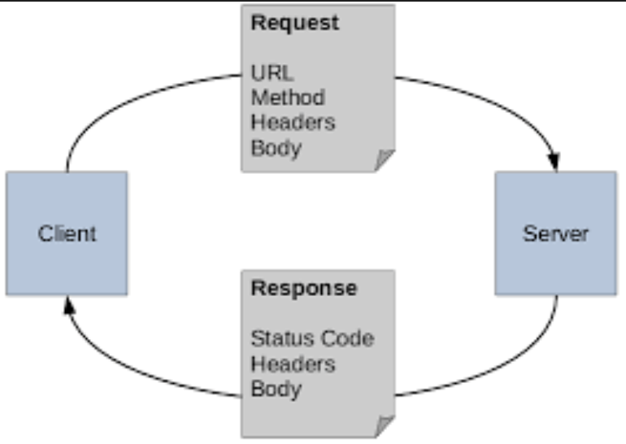
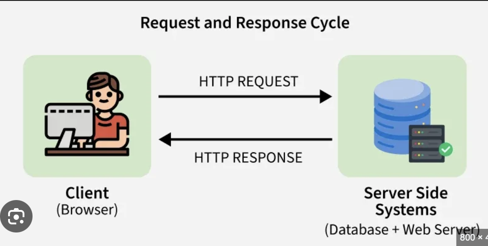
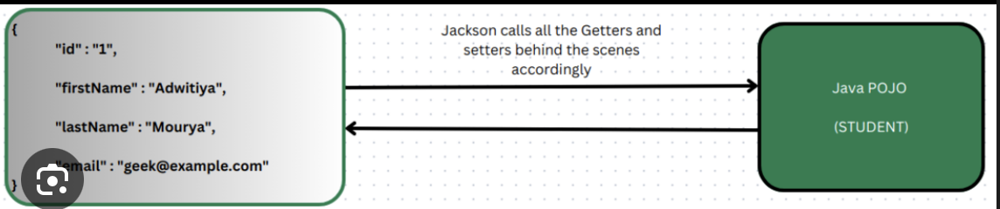
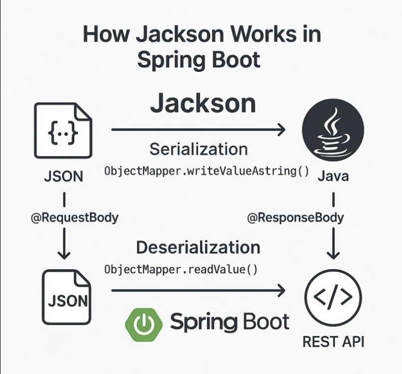
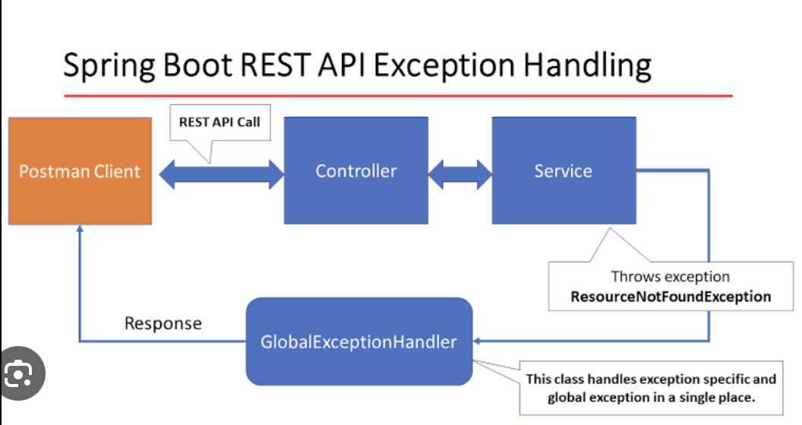
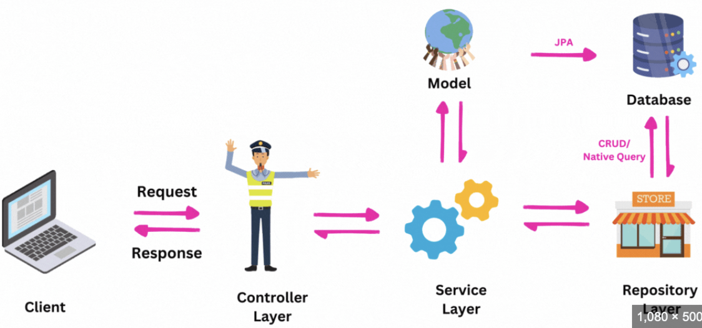

# REST APIs - REST Web Services
- You will learn
- Create REST APIs / Web Services with Spring 
- Discuss REST concepts, JSON and HTTP messaging 
- Install REST client tool: Postman 
- Develop REST APIs / Web Services with @RestController 
- Build a CRUD interface to the database with Spring REST

## REST is language independent
## What are REST Services
## REST over HTTP
- Most common use of REST is over HTTP 
- Leverage HTTP methods for CRUD operations HTTP Method

| CRUD   | Operation                                |
|--------|------------------------------------------|
| POST   | Create a new entity                      |
| GET    | Read a list of entities or single entity |
| PUT    | Update an existing entity                |
| DELETE | Delete an existing entity                |

## HTTP Request Message


- Request Line: The HTTP Command
- Header Variables: request Metadata
- Message Body: Content of message
## HTTP Response Message
- Response Line: Server protocol and status code
- Header Variables: Response Metadata
- Message Body: Content of message   

## HTTP Response - Status Codes

| Code Range | Description   |
|------------|---------------|
| 100 - 199  | Informational |
| 200 - 299  | Successful    |
| 300 - 399  | Redirection   |
| 400 - 499  | Client error  |
| 500 - 599  | Server error  |
## MIME Content Types
- The message format is described by MIME content type 
- Multipurpose Internet Mail-Extension 
- Basic Syntax: type/ subtype 
- Examples 
- text/html, text/plain
- application/json, application/XML

## Client Tool
- We need a client tool 
- Send HTTP requests to the REST Web Service / API 
- Plenty of tools available: curl, Postman, etc...
## Postman
- Postman makes API development easy
- Download and install Postman.
- Know basics of Postman
- https://jsonplaceholder.typicode.com
- put the below url in postmanGET url
- https://jsonplaceholder.typicode.com/users
## REST Controller
- Let's create a REST Controller
- REST Client => Test/hello => REST Service => Hello World => REST client
- REST Controller is a specialized version of a web controller used to build REST ful web services. 
- It is defined by the @RestController annotation, which handles incoming HTTP requests and automatically returns data directly to the client instead of rendering an HTML view.
- **Key Characteristics**
- **Composition:** It is a convenience annotation that combines @Controller and @ResponseBody.
- **Response Format:** By default, it serializes Java objects into JSON or XML formats using Spring’s message converters.
- **Implicit ResponseBody:** Every method in a @RestController class implicitly has @ResponseBody behavior, meaning the return value is written directly to the HTTP response body.
- **Use Case:** Ideal for modern web applications like single-page apps (React/Angular), mobile apps, and microservices where data exchange is primary.
- **Core Annotations Used Within a REST Controller**

| Annotation     | Purpose                                                  |
|----------------|----------------------------------------------------------|
| @GetMapping    | Handles HTTP GET requests (retrieving data).             |
| @PostMapping   | Handles HTTP POST requests (creating new resources).     |
| @PutMapping    | Handles HTTP PUT requests (updating existing resources). |
| @DeleteMapping | Handles HTTP DELETE requests (removing resources).       |
| @PathVariable  | Extracts dynamic values from the URL path.               |
| @RequestBody   | Maps the incoming HTTP request body to a Java object.    |
- **@RequestMapping("/test")**
- Class Level: When placed on a controller class, it defines a base URI (prefix) for all methods within that class.
- Example: @RequestMapping("/users") on a class means every method inside will start with /users.
- **Difference: @Controller vs. @RestController**

| Feature       | @Controller                                             | @RestController                          |
|---------------|---------------------------------------------------------|------------------------------------------|
| Primary Use   | Traditional web apps (Server-side rendering).           | REST ful APIs (Data-driven).             |
| Return Value  | Logical view name (e.g., "index") resolved to HTML.     | Data objects (JSON, XML).                |
| Serialization | Needs explicit @ResponseBody on methods to return data. | Automatic serialization for all methods. |

## REST Controller development process
- Add maven dependency for starter spring boot starter web
- Create a rest controller class
```
@RestController
@RequestMapping ("/test")
public class DemoRestController {
@GetMapping ("/hello")
public String sayHelo () { 
        return "Hello World!";
    }
}
```
- To test this, you can use postman or web browser
- Run the application and then hit the below URL
- localhost:8080/hello
- It will print in the web browser or postman.
## Java JSON Data Binding
- Data binding is a process of converting JSON data to a java POJO or Java POJO to JSON object.
- JSON Data Binding with Jackson
- Spring uses the jackson project behind the scenes
- Jackson handles the data binding between JSON and Java POJO.
- Details on Jackson Project - https://github.com/FasterXML/jackson
- By default, Jackson will call appropriate getter/ setter methods
## Spring and Jackson Support
- When building Spring REST applications 
- Spring will automatically handle Jackson Integration 
- JSON data being passed to REST controller is converted to POJO 
- Java object being returned from REST controller is converted to JSON
- 
- 
## Path Variables (@PathVariable)
- Retrieve a single student by id.
- GET - api/students/{studentId}
```
api/students/{0}
api/students/{1}
api/students/{2}
```  
- studentId is known as path variable.
### Development Process
- Add request mapping to spring REST service
- Bind path variable to method parameter using @PathVariable
- Example
```
@GetMapping("/students/{studentId}")
public Student getStudent(@PathVariable int studentId) {
    // just index into the list ... keep it simple for now
    return theStudents.get(studentId);
}
```
- For Example us the project : **04-spring-boot-rest-crud-students-path-variable-get-single-student**

## Spring REST exception handling
- If we pass bad student id above, we are getting ugly error response
```
{
    "timestamp":...
    "status": 500,
    "error": "Internal Server Error",
    "path": "/api/students/999"
}
```
- How to handle this in a nice way. it should return
```
{
    "status": 400,
    "message": "Student Id not found - 9999",
    "timestamp":12312312
}
```
### Development process
- Follow this source code - **05-spring-boot-rest-crud-students-exception-handling**
- Create a custom error response class
- Create a custom exception class
- Update the REST service to throw exception if student not found.
- Add an exception handler method using @ExceptionHandler
- **Step 1**
- The custom error response class will be sent back to client as JSON
- We will define a java class (POJO)
- Jackson will handle converting it to JSON.
- 
## Global Exception Handler
```
@RestControllerAdvice
public class GlobalExceptionHandler {

    @ExceptionHandler(UserNotFoundException.class)
    public ResponseEntity<String> handleUserNotFound(UserNotFoundException ex) {
        return new ResponseEntity<>(ex.getMessage(), HttpStatus.NOT_FOUND);
    }

    @ExceptionHandler(Exception.class)
    public ResponseEntity<String> handleGenericException(Exception ex) {
        return new ResponseEntity<>(
                "Something went wrong",
                HttpStatus.INTERNAL_SERVER_ERROR
        );
    }
}
```
- **ErrorResponse**
```
public class ErrorResponse {

    private String message;
    private int status;
    private LocalDateTime timestamp;

    // getters & setters
}
```
- **@RestControllerAdvice**
```
@RestControllerAdvice
public class GlobalExceptionHandler {

    @ExceptionHandler(UserNotFoundException.class)
    public ResponseEntity<ErrorResponse> handleUserNotFound(UserNotFoundException ex) {

        ErrorResponse error = new ErrorResponse();
        error.setMessage(ex.getMessage());
        error.setStatus(HttpStatus.NOT_FOUND.value());
        error.setTimestamp(LocalDateTime.now());

        return new ResponseEntity<>(error, HttpStatus.NOT_FOUND);
    }
}
```
- **Handling Validation Errors (Very Common)**
```
  @ExceptionHandler(MethodArgumentNotValidException.class)
  public ResponseEntity<Map<String, String>> handleValidationErrors(
  MethodArgumentNotValidException ex) {

  Map<String, String> errors = new HashMap<>();

  ex.getBindingResult().getFieldErrors().forEach(error ->
  errors.put(error.getField(), error.getDefaultMessage())
  );

  return new ResponseEntity<>(errors, HttpStatus.BAD_REQUEST);
  }
```
## REST API Design
- FOr real-time projects, Who will use your API ?
- Also, how will they use your API ?
- Design the API based on requirements
- **Process**
1) Review API requirement
2) Identify main resource/ Entity
3) Use HTTP methods to assign action on resource
## Bad practice
- api/employeeList
- api/deleteEmployee
- api/addEmployee
- api/updateEmployee
- Instead of above use HTTP methods(GET, POST, PUT, DELETE) to assign actions

| HTTP METHOD | End Point                  | CRUD action                 |
|-------------|----------------------------|-----------------------------|
| POST        | api/employees              | Create a new Employee       |
| GET         | api/employees              | Read a list of Employee     |
| GET         | api/employees/{employeeId} | Red a single Employee       |
| PUT         | api/employees              | Update an existing Employee |
| DELETE      | api/employees/{employeeId} | Delete an existing Employee |

## Check the other API examples
- On the following we will look at APIs from other real time projects
- PayPal - https://developer.paypal.com/docs/api/invoicing/v2/
- GitHub - https://docs.github.com/en/rest/commits/commits?apiVersion=2022-11-28
### Add A service Layer
- **Purpose of Service Layer**
- Service Facade design pattern.
- Intermediate layer for custom business logic.
- Integrate data from multiple sources(DAO/repositories)
- Employee Rest Controller <=> Employee Service <=> Employee Dao <=> Database
- 
- **Specialized Annotation for Services**
- Spring provides the @Service annotation
- @Service applied to service implementation
- Spring will automatically register the service implementation.
- thanks to Component-scanning.
### Development process
- Define Service Interface
- Define Service Implementation
- Inject the EmployeeDao
```
public interface EmployeeService {
    List<Employee> findAll();
}
```
- Service Implementation
```
@Service
public class EmployeeServiceImpl implements EmployeeService {
    private EmployeeDAO employeeDAO;
    @Autowired
    public EmployeeServiceImpl(EmployeeDAO theEmployeeDAO) {
        employeeDAO = theEmployeeDAO;
    }
    @Override
    public List<Employee> findAll() {
        return employeeDAO.findAll();
    }
}
```
## @Transactional
- @Transactional ensures that a group of database operations execute as a single unit of work.
- All succeed → COMMIT
- Any failure → ROLLBACK
### Why do we need it?
- Databases follow ACID properties:
- Atomicity, Consistency, Isolation, Durability
- @Transactional mainly enforces:
  - Atomicity 
  - Consistency
- **Example**
```
  public void placeOrder() {
  orderRepository.save(order);       // Saved
  paymentService.charge();            // - fails
  inventoryService.updateStock();     // Not executed
  }
```  
- - Result: FAILED
- Order is saved
- Payment failed
- Database is inconsistent
### Service Layer - Best Practice
- Best practice is to apply transactional boundaries at the service layer 
- It is the service layer's responsibility to manage transaction boundaries
- For implementation code 
  - Apply @Transactional on service methods 
  - Remove @Transactional on DAO methods if they already exist
### Development Process
1.    Set up Database Dev Environment
2.    Create Spring Boot project using Spring Initializer
3.    Get list of employees
4.    Get single employee by ID
5.    Add a new employee
6.    Update an existing employee
7.    Delete an existing employee
### Sending JSON to spring REST Controller
- When sending JSON data to Spring REST Controllers 
- For controller to process JSON data, need to set an HTTP request header 
- Content-type: application/ json 
- Need to configure REST client to send the correct HTTP request header
- **How to send in Postman**
- Must set HTTP request header in Params
- Body and paste the json
```
{
    "firstName":"siba",
    "lastName":"Prasad",
    "email":"siba@gmail.com"
}
```
### Update Employee
- **For Example find code 13-spring-boot-rest-crud-employee-rest-controller-update-employee**
- **Development Process**
- Inject helper class: JsonMapper
- Add support for @PatchMapping request method.
- Apply patch payload to employee
- **Step 1:** Inject helper class: JsonMapper 
- JsonMapper is a helper class in the Jackson library for JSON processing 
- IsonMapper provides following support 
- Converts Java objects to JSON and vite-versa 
- Allows merging of JSON nodes 
- Provides type safety for conversions: Java <-> JSON 
- The IsonMapper is preconfigured by Spring
## Step 2: Add support for @PatchMapping request method
### PATCH
- The approach shown in the previous slides covers the majority of use cases for partial updates 
- However, if you have complex use cases 
- Deeply nested JSON entities 
- Add, move, remove, copy fields 
- Move / manipulate array elements 
- Complex transformations / data enrichment 
- RFC 6902 - JSON Patch - https:/ /www.rfc-editor.org/rfc/rfc6902.html
- RFC 7386 - JSON Merge Patch - https: //www.rfc-editor.org/rfc/rfc7386.html
- json-patch project - https://github.com/java-json-tools/json-patch
- **For Example check Rest controller class in 14-spring-boot-rest-crud-employee-rest-controller-patch-employee**
### Patch mapping
- Example: **15-spring-boot-rest-crud-employee-rest-controller-delete-employee**
- **1 What is @PatchMapping in Spring Boot?**;p[']
- @PatchMapping is a Spring MVC annotation used to handle HTTP PATCH requests.
- A PATCH request is meant for partial updates of a resource — meaning only some fields are updated, not the entire object.
```
@PatchMapping("/users/{id}")
   public User updateUserPartially(@PathVariable Long id,
   @RequestBody Map<String, Object> updates) {
   ...
   }
```   
- **2. Why is @PatchMapping used?**
- It is used when:
- You want to update only specific fields.
- You do not want to send the full object. 
- You want to avoid accidentally overwriting unchanged fields. 
- You are following REST ful API best practices.
- Example real-world scenario:
- Updating only email or phone number of a user. 
- Updating only order status.
- Updating only password.
- **3. Example: PATCH in Spring Boot**
- Entity
```
   @Entity
   public class User {
       @Id
       private Long id;
       private String name;
       private String email;
       private String phone;
   }
```   
- PATCH Controller Example
```
  @RestController
   @RequestMapping("/users")
   public class UserController {

   @Autowired
   private UserRepository userRepository;

   @PatchMapping("/{id}")
   public User patchUser(@PathVariable Long id, @RequestBody Map<String, Object> updates) {

        User user = userRepository.findById(id)
                .orElseThrow(() -> new RuntimeException("User not found"));

        updates.forEach((key, value) -> {
            switch (key) {
                case "name":
                    user.setName((String) value);
                    break;
                case "email":
                    user.setEmail((String) value);
                    break;
                case "phone":
                    user.setPhone((String) value);
                    break;
            }
        });

        return userRepository.save(user);
        }
}
```
- PATCH Request Example
```
URL: http://127.0.0.1:8080/api/employees/1
Content-Type: application/json

{
    "email": "newemail@gmail.com"
}
```
- Only email is updated
- name and phone remain unchanged
- Use Below Example
## Spring Data JPA
- **16-spring-boot-rest-crud-employee-with-spring-data-jpa**
- Let's consider, I have multiple type of tables, Employee, Product, Book etc.
- I have created EmployeeDAO class for employee operation.
- Do I need repeat the same for all other types?
- Is there any common solutions for this.
- Here Data JPA comes to picture
- Create a DAO and just plugin your entity type and primary key.
- Spring will give you CRUD implementation for FREE.
- It helps to minimize boiler-plate DAO code.
- Spring Data JPA is a Spring module that simplifies database access using JPA (Java Persistence API).
- **👉 It removes boilerplate code like:**
- Writing SQL queries 
- Managing EntityManager 
- Writing DAO implementations
- You just:
- Define an Entity
- Create a Repository interface
- Spring handles the rest automatically
- **2. Why Use Spring Data JPA?**
- Without Spring Data JPA:
- You write SQL / JPQL 
- You manage transactions 
- You write CRUD logic manually 
- **With Spring Data JPA:** 
- No SQL for basic operations
- Auto-generated CRUD methods 
- Clean, readable code 
- Faster development
- **3. Spring Data JPA Architecture**
   Controller <=> Service <=> Repository (Spring Data JPA) <=> JPA (Hibernate) <=> Database
- **4.Add dependencies**
```
<dependency>
    <groupId>org.springframework.boot</groupId>
    <artifactId>spring-boot-starter-data-jpa</artifactId>
</dependency>

<dependency>
    <groupId>com.mysql</groupId>
    <artifactId>mysql-connector-j</artifactId>
</dependency>
```
- Update application.properties file
```
spring.datasource.url=jdbc:mysql://localhost:3306/testdb
spring.datasource.username=root
spring.datasource.password=root

spring.jpa.hibernate.ddl-auto=update
spring.jpa.show-sql=true
spring.jpa.properties.hibernate.dialect=org.hibernate.dialect.MySQL8Dialect (Remove this, search what is the usage)
```
- Spring Data JPA provides JpaRepository Interface
```
public interface UserRepository extends JpaRepository<User, Long> {
}
```
- Above is JpaRepository for User class
- Example for Employee
```
public interface EmployeeRepository extends JpaRepository<Employee, Integer> {
}
```
- This Interface will provide all the boilerplate methods
```
    find()
    findAll()
    save
    update
    delete
```
### Advanced Features available for
- Extending and adding custom queries with JPQL
- Query Domain Specific language(Query DSL)
- Defining custom methods(Low level coding)
```
public interface EmployeeRepository extends JpaRepository<Employee, Integer> {
    // that's it ... no need to write any code LOL!
}
```
### Spring Data Rest
- **What is Spring Data REST?**
- Builds RESTful APIs on top of Spring Data repositories
- Automatically exposes CRUD endpoints
- Follows REST + HATEOAS standards 
- Eliminates boilerplate controllers
- Dependency  ```spring-boot-starter-data-rest```
### Why use Spring Data REST?
- **Without Spring Data REST ❌**, You write:
- Entity, Repository, Service, Controller, DTO mappings
- **With Spring Data REST ✅**
- You write: Entity, Repository
➡ REST API is auto-generated
```
@Entity
public class Employee {
    @Id
    @GeneratedValue
    private Long id;
    private String name;
    private String Email;
}
```
- Repository
```
@RepositoryRestResource
public interface BookRepository extends JpaRepository<Book, Long> {}
```
| HTTP Method | Example                 | CRUD Action                 |
|-------------|-------------------------|-----------------------------|
| POST        | /employees              | Create a new employee       |
| GET         | /employees              | Read a list of employee     |
| GET         | /employees/{employeeId} | Read a single employee      |
| PUT         | /employees/{employeeId} | Update an existing employee |
| DELETE      | /employees/{employeeId} | Delete an existing employee |
### When SHOULD you use Spring Data REST? ✅
- Admin tools
- Internal APIs
- Rapid prototyping
- Simple CRUD apps
- Low business logic
## When NOT to use it ❌
- Complex business workflows
- Public APIs
- Heavy customization
- DTO-heavy systems
- Strict API contracts
## Configuration, Pagination, Sorting
- Add details
## Spring REST API Documentation - Swagger
- What is Swagger?
- Swagger is a tool used to document REST APIs and test them interactively through a web UI.
- In Spring Boot today, Swagger is commonly implemented using Spring doc OpenAPI, which is the official and recommended replacement for the old Swagger libraries.
- **2. Why Use Swagger in Spring Boot?**
- Problems Without Swagger
- - No clear API documentation 
- - Frontend & QA don’t know request/response format 
- - Manual API testing using Postman 
- - APIs hard to understand for new developers 
- **Benefits of Swagger**
- Auto-generates API documentation 
- Shows endpoints, request params, headers, responses
- Built-in UI to test APIs from browser
- Always stays in sync with code
- Improves team collaboration
- **3. What Swagger Provides**
- When Swagger is enabled, it gives you:
- Swagger UI → Web interface for API testing
- OpenAPI JSON → Machine-readable API spec
- Example:
```
   GET /users
   POST /users
   PUT /users/{id}
   PATCH /users/{id}
```   
- All visible & testable in browser.
- **4. Swagger Flow in Spring Boot**
   - Controller → Swagger Annotations → OpenAPI Spec → Swagger UI
- **5. How to Set Up Swagger in Spring Boot (Recommended Way)**
- Step 1: Add Dependency (Spring Boot 3+)
```
   <dependency>
   <groupId>org.springdoc</groupId>
   <artifactId>springdoc-openapi-starter-webmvc-ui</artifactId>
   <version>2.5.0</version>
   </dependency>
```   
- ✅ No configuration class required
- ✅ Works out of the box
- Step 2: Run Application
- Once the app starts, open:
- http://localhost:8080/swagger-ui.html
   or
- http://localhost:8080/swagger-ui/index.html
- Swagger UI is ready!
- **6. Example Spring Boot Controller**
```
   @RestController
   @RequestMapping("/users")
   public class UserController {

   @GetMapping
   public List<String> getUsers() {
   return List.of("John", "Alice");
   }

   @PostMapping
   public String createUser(@RequestBody String user) {
   return "User created: " + user;
   }
   }
```   
- Swagger will automatically show:
- Endpoint paths
- HTTP methods
- Request body
- Response type
- **7. Enhancing Swagger with Annotations**
- Add API Info
```
   @OpenAPIDefinition(
   info = @Info(
   title = "User API",
   version = "1.0",
   description = "User management APIs"
   )
   )
   @SpringBootApplication
   public class DemoApplication {
   public static void main(String[] args) {
   SpringApplication.run(DemoApplication.class, args);
   }
   }
```   
- Document an API Method
```
   @Operation(summary = "Get all users", description = "Fetches all users from DB")
   @GetMapping
   public List<String> getUsers() {
   return List.of("John", "Alice");
   }
```  

- Document Request Body
```  
   @PostMapping
   @Operation(summary = "Create user")
   public String createUser(
   @RequestBody(description = "User name") String user) {
   return "User created";
   }
```   
- **8. Swagger vs Postman**

| Swagger           | Postman         |
|-------------------|-----------------|
| Auto-generated    | Manual          |
| Always up to date | Can be outdated |
| Interactive UI    | Separate tool   |
| API documentation | API testing     |
- Swagger is documentation + testing 
- Postman is testing only
- **9. When Should You Use Swagger?**
- Use Swagger when:
- Building REST APIs
- Working in a team
- Exposing APIs to frontend or third-party users
- Want fast testing without Postman

# Do all the examples