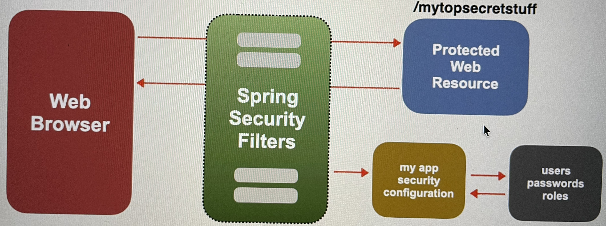
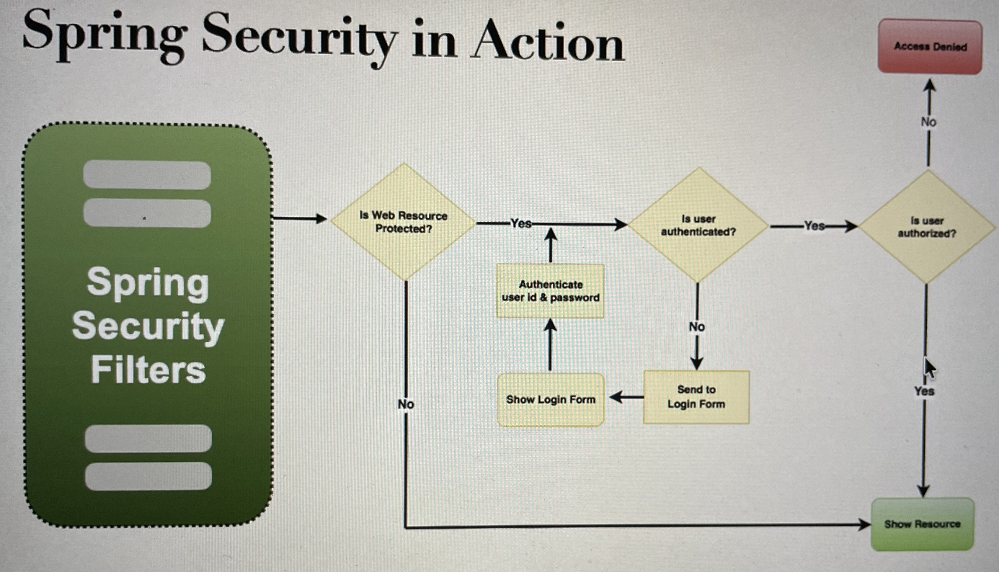

# Spring Boot API Security
- You will learn
1) Secure Spring boot REST APIs
2) Define Users and roles
3) Protect URLs based on role.
4) Store users, passwords, and roles in DB (PLain-text -> Encrypted)
## Spring Security Model
- Spring security defines a framework for security.
- Implemented using servlet filters in the background.
- Two methods of securing an app: Declarative and programmatic
## Spring Security with servlet Filters
- Servlet filters are used to pre-process / post -process web requests.
- Servlet filters can route web requests based on security logic.
- Spring provides a bulk of security functionality with servlet filters.
- Spring Security Overview

- 
## Security Concepts
- **Authentication:** Check user id and password with credentials stored in app / db
- Check application.properties file for username and password
```
spring.security.user.name=scott
spring.security.user.password=test123
```
- **Authorisation:** Check to see if user has an authorised role.
## Declarative Security
- Define application's security constraints in configuration
- All java config: @Configuration
- Provides separation of concerns between application code and security.
## Programmatic Security
- Spring Security provides an API for custom application coding.
- Provides greater customization for specific app requirements.
## Enabling Spring Security
- Add dependencies
```
<dependency>
			<groupId>org.springframework.boot</groupId>
			<artifactId>spring-boot-starter-security</artifactId>
</dependency>
```
- This will automatically secure all endpoints for application
## Secure Endpoints
- Now when you access your application
- Spring security will prompt for Login
## Spring Security Configuration
- You can override default username and generated password 
```
application.properties file
spring.security.user.name=siba
spring.security.user.password=siba
```
- If you don't define this, then in command line it will generate password and user is user
## Authentication and authorization Ways
- In-memory
- JDBC
- LDAP
- Custom/ Pluggable
- Others
## Basic Security Configuration
- We have 3 types of user
- Employee, Employee + Manager, Employee + Manager + ADMIN
### Development Process
- Create Spring security Configuration(@Configuration)
- Add user, passwords, roles
```
@Configuration
public class DemoSecurityConfig {
    // add our security configuration here
}
```
## Spring security Password Storage
- IN Spring Security, passwords are stored using a specific format.
- ```{id}encodedPassword```

| ID     | Description             |
|--------|-------------------------|
| noop   | Plain text passwords    |
| bcrypt | BCrypt password hashing |
- Example
```
{noop}test123
```
- **Step 2: Add users, passwords and roles**
- File: DemoSecurityConfig.java
```
@Configuration
public class DemoSecurityConfig {
@Bean
public InMemoryUserDetailsManager userDetailsManager) {

UserDetails john = User. builder(
    .username("john")
    .password("{noop)test123")
    .roles("EMPLOYEE" )
    .build();
  
UserDetails mary = User. builder()
    .username("mary")
    .password("(noop)test123" )
    .roles("EMPLOYEE", "MANAGER")
    .build();
    
UserDetails susan = User. builder()
    .username("susan")
    .password("(noop)test123")
    .roles("EMPLOYEE", "MANAGER", "ADMIN")
    .build();
    
return new InMemoryUserDetailsManager
```
- You have the employee starter project.
- On top of add this code
- Now run the application
- Open postman and hit the url : http://127.0.0.1:8080/api/employees
- It will throw Unauthorized error in postman
- In postman, got to authorisation -> select type -> basic Auth, enter username and password from above.
- Now hit the url, you will receive response.
## Restrict access based on role
- Here is our task

| HTTP Method | Endpoint                    | CRUD action     | Role     |
|-------------|-----------------------------|-----------------|----------|
| GET         | /api/employees              | Read All        | Employee |
| GET         | /api/employees/{employeeId} | Read Single     | Employee |
| POST        | /api/employees              | Create          | Manager  |
| PUT         | /api/employees              | Update          | Manager  |
| DELETE      | /api/employees/{employeeId} | Delete Employee | Admin    |
- Restricting Access to Roles
```
requestMatchers(<< add path to match on >>)
    .hasRole(<< authorized role >>)
```
- Restricting access to roles
```
requestMatchers(<< add HTTP method match on >>, << add path to match on >>)
    .hasRole(<< authorized role >>)
```
- add HTTP method match on : Specify methods here - GET, POST, PUT, DELETE
- add path to match on : Mention endpoints : /api/employees etc
- If you want to add multiple roles, you can add by comma
```
.hasRole(MANAGER, ADMIN)
```
- Example for Employee
```
requestMatchers(HttpMethod.GET, "/api/employees").hasRole("EMPLOYEE")
requestMatchers(HttpMethod.GET, "/api/employees/**").hasRole("EMPLOYEE") // this will handle in case reading a single employee
```
- Example for MANAGER
```
requestMatchers(HttpMethod.PUT, "/api/employees").hasRole("MANAGER")
requestMatchers(HttpMethod.POST, "/api/employees/").hasRole("MANAGER")
```
- Example for ADMIN
```
requestMatchers(HttpMethod.DELETE, "/api/employees/**").hasRole("ADMIN")
```
- Find the complete example : **03-spring-boot-rest-security-restrict-access-based-on-roles**
- DemoSecurityConfig.java
## Cross-Site Request Forgery (CSRF)
- Spring Security can protect against CSRF attacks 
- Embed additional authentication data/ token into all HTML forms
- On subsequent requests, web app will verify token before processing
- Primary use case is traditional web applications (HTML forms etc...)
## When to use CSRF Protection?
- The Spring Security team recommends
  - Use CSRF protection for any normal browser web requests
  - Traditional web apps with HTML forms to add / modify data
- If you are building a REST API for non-browser clients
  - you may want to disable CSRF protection
- In general, not required for stateless REST APIs
  - That use POST, PUT, DELETE and / or PATCH
## How to disable or Enable CSRF
```
http.csrf(csrf →> csrf.disable ());
```
## 403 Error with PUT REQUEST
- When using spring data REST for PUT requests the ID is on the URL /api/employees/{employeeId}
- As a result, need to modify security configuration.
- Code change : DemoSecurityConfig.java
```
Replace
.requestMatchers(HttpMethod.PUT, "/api/employees").hasRole("MANAGER")

with

.requestMatchers(HttpMethod.PUT, "/api/employees/**").hasRole("MANAGER")
```
- Note use of /** because the ID is passed on the URL for PUT requests using Spring Data REST
## Restrict Access Based on Roles Patch - partial Update
```
.requestMatchers(HttpMethod.PATCH, "/api/employees/**").hasRole("MANAGER")
```
## Spring Security User Accounts Stored in Database
- Database Access
- SO far, our user accounts were hard coded in Java source code.
- We want to add database access
- **Database support in Spring Security**
- Spring Security can read user account info from database.
- By default, you have to follow Spring Security's predefined table schemas.
- Spring Security <=> JDBC Code <=> Database
- **Customized Database access with Spring Security**
- Can also customize the table schemas.
- Useful if you have custom tables specific to your project / custom.
- You will be responsible for developing the code to access the data
  - JDBC, JPA/Hibernate etc..
- **Development Process**
- Find the example : **05-spring-boot-rest-security-jdbc-plain-text**
1) Develop SQL script to set up database tables
2) Add database support to maven POM file
3) Create JDBC properties file
4) Update Spring Security Configuration to use JDBC.
- Add database Support dependencies
```
<dependency>
			<groupId>com.mysql</groupId>
			<artifactId>mysql-connector-j</artifactId>
			<scope>runtime</scope>
</dependency>
```
- Create JDBC properties file

## Spring Security Password Encryption
- Password Storage Best Practice : The best practice is to store passwords in an encrypted format.
- **Spring Security Team Recommendation**
- Sprig security recommends using the popular **bcrypt** algorithm.
- **bcrypt**
- Performs one-way encrypted hashing
- Adds a random salt to the password for additional protection
- Includes support to defeat brute force attacks.
- **How to get a Bcrypt password**
- You have a plaintext password, and you want to encrypt using bcrypt.
- Option 1 : Use a website utility to perform encryption. 
- You can use https://bcrypt-generator.com
- Option 2: Write java code to perform the encryption.
- **Development Process**
- Run SQL Script that contains encrypted passwords.
- Modify DDL for password fields, length should be 68
- That's it, No need to change Java source code.
- **Spring Security Login Process**
1) Retrieve password from db for the user.
2) Read the encoding algorithm id(bcrypt etc.)
3) For case of bcrypt, encrypt plaintext password from login form (using salt from db password)
4) Compare encrypted password from login form WITH encrypted password from db.
5) If there is a match, login successful.
6) If no match, login NOT successful.
- NOTE: The password from db is NEVER decrypted.
- Because bcrypt is a one-way encryption algorithm.
## Spring Security Custom Tables
- In real time scenario, We don't use the default table column names provided by Spring security (i.e. userName, Password)
- You can have your custom column name.
- **For Security Schema customization**
- Tell Spring how to query your custom tables
- Provide query to find user by username.
- Provide query to find authorities / roles by username.
- **Development Process**
1) Create our custom table with SQL.
2) Update Spring Security Configuration.
    - Provide query to find user by username
    - Provide query to find authorities / roles by username
1) Custom table : User
- User_id, pw, active
2_ Custom table : role
- user_id
- role
- **Find the Example here: 07-spring-boot-rest-security-jdbc-bcrypt-custom-table-names**
- 