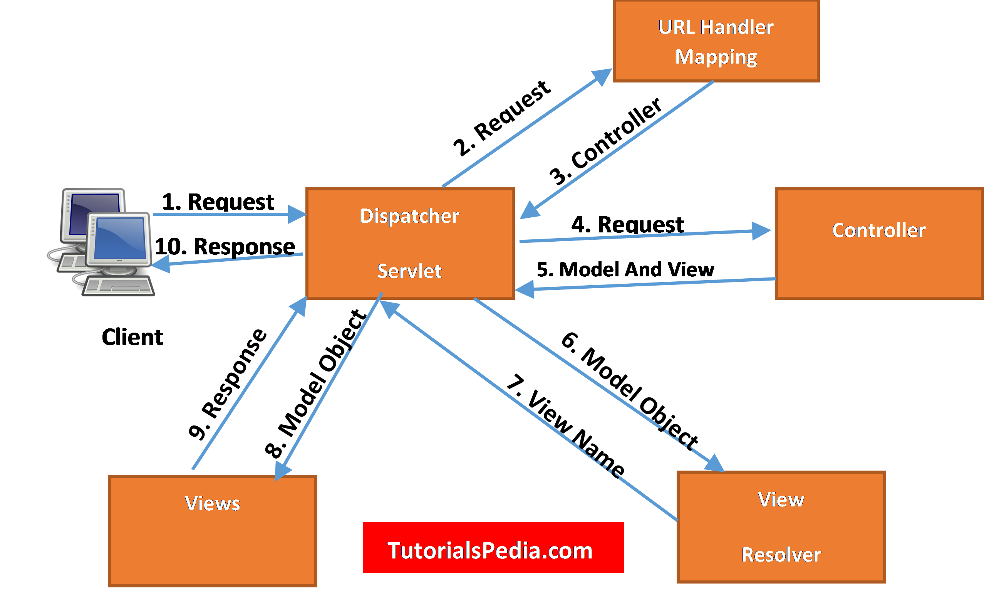
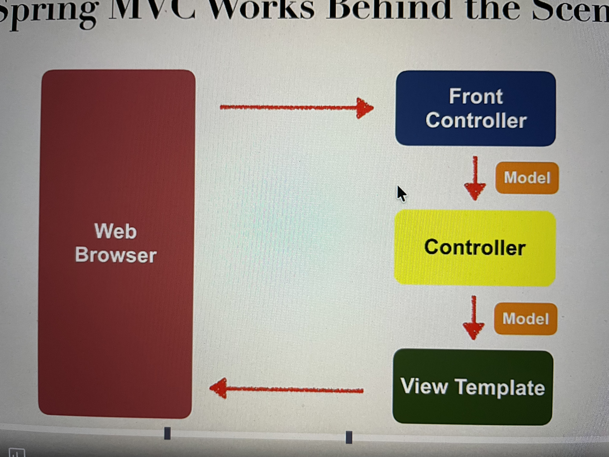
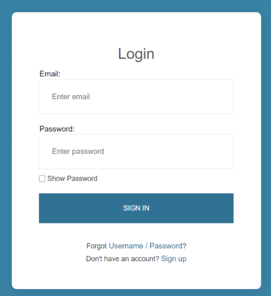

# Spring MVC
## [CODE EXAMPLE](https://github.com/siba-x-prasad/SpringBoot-Playground/tree/main/udemyCourse/06-spring-boot-spring-mvc)
- **What is Spring MVC?**
- Spring MVC separates an application into three main components:
- **Model** – Holds the business data (Java objects, database entities)
- **View** – Displays the data (HTML, JSP, Thymeleaf, JSON, etc.)
- **Controller** – Handles HTTP requests and controls the flow of the application
- Spring MVC acts as the bridge between the client (browser or API consumer) and the backend logic.
## What is Spring MVC used for?
- Spring MVC is used to:
1. Build Web Applications
   - Traditional server-rendered websites
   - Forms, pages, dashboards
   - Uses views like JSP, Thymeleaf, or Freemarker
2. Build REST ful APIs
   - JSON/XML-based APIs
   - Used in microservices and backend systems
   - Works well with Spring Boot
3. Handle HTTP Requests
   - Maps URLs to Java methods
   - Supports HTTP methods: GET, POST, PUT, DELETE
   - Example:
   ```
   @GetMapping("/users")
   public List<User> getUsers() {
        return userService.findAll();
   }
   ```
4. Data Binding & Validation
   - Automatically converts request data into Java objects
   - Validates input using annotations like @NotNull, @Size
5. Integrate with Other Spring Modules
   - Spring Security – authentication & authorization
   - Spring Data JPA – database access
   - Spring Boot – auto-configuration & faster development
## How Spring MVC works behind the scene

## Spring MVC Front Controller

- Front Controller known as DispatcherServlet
  - Part of the Spring Framework.
  - Already developed by Spring Dev team.
- You will create 
  - Model Objects
  - View Templates
  - Controller classes
### Controller 
- Code created by developer
- Contains your business logic
- Handle request
- Store/ retrieve data (db, web services)
- Place data in model
- Send to appropriate view template.
### Model
- Model: contains your data.
- Store/ retrieve data via backend systems
  - Database, web service, etc.
  - Use Spring bean if you like.
- Place your data in the model.
  - Data can be any java object / collection
### View Template
- Spring MVC is flexible
- supports many view templates
- Recommended : Thymeleaf
- Developer creates a page
  - Displays data
- Other View Templates supported
  - Groovy, Velocity, Freemarker, etc.
## Reading Form Data with Spring MVC
- Let's consider, we have a form with text field to enter name. WHen user click on submit, it will display name on the page
```
@Controller
public class HelloWorldCOntroller {
// need controller method to show intial HTML form
    @RequestMapping("/showForm")
    public STring showForm() {
        return "helloworld-form";
    }
    
    // need a controller method to process the HTML form
    @RequestMapping("/processForm")
    public STring processForm() {
        return "helloworld";
    }
}
```
### Development Process
1) Create Controller Class 
2) Show HTML form
   - Create controller method to show HTML form
   - Create View Page for HTML form
3) Process HTML form
   - Create controller method to process HTML form
   - Develop View Page for Confirmation
### Source Code : [03-reading-html-form-data](https://github.com/siba-x-prasad/SpringBoot-Playground/tree/main/udemyCourse/06-spring-boot-spring-mvc/03-reading-html-form-data)

## Adding Data to Spring Model
## Spring Model
- The Model is a container for your application data.
- In your Controller
  - You can put anything in the model.
  - Strings, Objects, info from database, etc.
- Your View page can access data from the model.
### Code Example
- We want to create a new method to process from data
- Read the form data: student's name
- Convert the name to upper case
- Add the uppercase version to the model.
- **Code Example : [04-adding-data-to-the-model](https://github.com/siba-x-prasad/SpringBoot-Playground/tree/main/udemyCourse/06-spring-boot-spring-mvc/04-adding-data-to-the-model)**
## Reading HTML form Data with @RequestParam Annotation
-  Instead of Using HttpServletRequest
```
@RequestMapping("/processFormVersionTwo" )
public String letsShoutDude(HttpServletRequest request, Model model) {
// read the request parameter from the HTML form
String theName = request. getParameter ("studentName");
...
}
```
- Bind Variable using @RequestParam Annotation
```
@RequestMapping("/processFormVersionTwo")
public String letsShoutDude( @RequestParam ("studentName") String theName, Model model) {
// now we can use the variable: theName
}
```
- Behind the scenes:
  - Spring will read param from request: studentName
  - Bind it to the variable: theName
- Code Example **[05-binding-request-params](https://github.com/siba-x-prasad/SpringBoot-Playground/tree/main/udemyCourse/06-spring-boot-spring-mvc/05-binding-request-params)**
- Check **@RequestMapping("/processFormVersionThree")** in above HelloWorldController.class
- Run the main application and hit the url **http://localhost:8080/showForm**
## @GetMapping and @PostMapping
- HTML Form <=> REQUEST/ RESPONSE <=> Spring MVC Controller
- **MOst Commonly used HTTP methods**
  - GET, POST
### Sending data with GET method
```
<form th:action="@{/processForm}" method = "GET" ...>
...
</form>
```
- Form data is added to end of URL as name/value pairs
- theUrl?field1=value1&field2=value2...
- **Handling form submission**
```
@RequestMapping("/processForm")
public String processForm(...){

}
```
- This mapping handles ALL HTTP methods - GET, POST, etc.
- **Code Example : [06-getmapping-and-postmapping](https://github.com/siba-x-prasad/SpringBoot-Playground/tree/main/udemyCourse/06-spring-boot-spring-mvc/06-getmapping-and-postmapping)**
## Spring MVC form Tag - Text Field
### Code example [07-form-data-binding-textfields](https://github.com/siba-x-prasad/SpringBoot-Playground/tree/main/udemyCourse/06-spring-boot-spring-mvc/07-form-data-binding-textfields)
- HTML forms are used to get input from the user

- **Data Binding**
- Spring MVC forms can make use of data binding.
- Automatically setting / retrieving data from a java object / bean
- Student-form.html => Student  => StudentController => student-confirmation.html
- **Showing form**
- In your spring controller
  - Before you show the form, you must add a model attribute.
  - This is a bean that will hold form data for the data binding.
- Show Form - add model attribute
```
 @GetMapping("/showStudentForm")
    public String showForm(Model theModel) {

        // create a student object
        Student theStudent = new Student();

        // add student object to the model
        theModel.addAttribute("student", theStudent);

        return "student-form";
    }
```