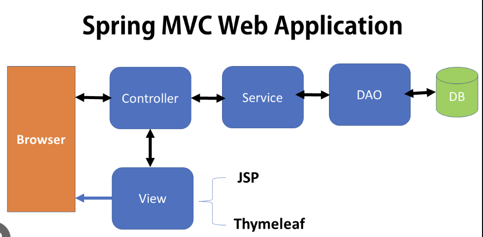

# Thymeleaf
## [CODE EXAMPLE](https://github.com/siba-x-prasad/SpringBoot-Playground/tree/main/udemyCourse/06-spring-boot-spring-mvc)
- What is Thymeleaf?
- Thymeleaf is a Java templating engine
- Official website : Thymeleaf : www.thymeleaf.org
- Commonly used to generate the HTML views for web apps 
- However, it is a general purpose templating engine 
- Can use Thymeleaf outside of web apps (more on this later)
- **What is Thymeleaf template?**
- Can be an HTML page with some Thymeleaf expressions.
- Include dynamic content from Thymeleaf expressions.
- **Where is the Thymeleaf template processed?**
- In web app, Thymeleaf is processed on the server
- Result includes HTML returned to browser.
- 
- **Development Process**
1) Add Thymeleaf to maven POM file.
```
<dependency>
			<groupId>org.springframework.boot</groupId>
			<artifactId>spring-boot-starter-thymeleaf</artifactId>
			<scope>runtime</scope>
		</dependency>
```
2) Develop spring MVC controller.
```
@Controller
public class DemoCOntroller {
    @GetMapping("/")
    public String sayHello(Model theModel) {
        theModel.addAttribute("theData", java.time.LocalDatreTime.now());
        return "helloWorld";
    }
}
```
3) Create Thymeleaf template.
```
<!DOCTYPE HTML>
<html xmlns:th="http://www.thymeleaf.org">
    <head>
        <title>Thymeleaf Demo</title>
    </head>
    <body>
        <p th:text="'Time on the server is ' + ${theDate}" />
    </body>
</html>
```
## Additional features
- Looping and conditionals
- CSS and Javascript Integration
- Template layouts and fragments
## Spring MVC with Thymeleaf and CSS
- You have the option of using
- Local CSS files as part of your project
- Referencing remote CSS files
- We'll cover both options in this video
- **Development Process**
1) create CSS file
2) Reference CSS in Thymeleaf template
3) Apply CSS style
- For Example Follow : **02-thymeleafdemo-helloworld-css**
## Spring MVC Behind the Scene
- **Components of a Spring MVC application**
- A set of web pages to layout UI components.
- A collection of Spring Beans (controllers, Services, etc.)
- Spring Configuration (XML, Annotation or Java)